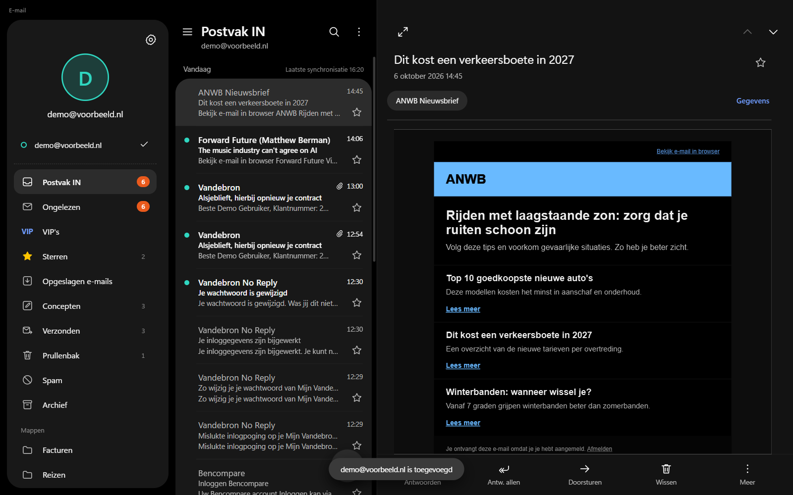

# E-mail for Windows

A desktop clone of [Samsung Email](https://play.google.com/store/apps/details?id=com.samsung.android.email.provider) for Windows, built with Electron. It follows the One UI tablet layout: a drawer with accounts and folders, a message list grouped by day, and a reading pane with the familiar bottom action bar. The interface is in Dutch, like the phone app it copies.



## What works

- IMAP accounts for Google, Yahoo, Outlook, Exchange, Office365 and any other provider, with preset servers per provider and manual IMAP/SMTP settings.
- A demo account with sample mail, so you can try the app without credentials.
- Unified inbox across accounts ("Alle accounts") with unread badges per account.
- Drawer views from the phone app: Postvak IN, Ongelezen, VIP's, Sterren, Opgeslagen e-mails, Concepten, Verzonden, Prullenbak, plus Spam, Archief and your own folders per account.
- Reading pane with sender chip, "Gegevens" details, attachments (open or save), previous/next navigation and a full-width mode.
- HTML mail renders in a sandboxed frame with scripts stripped. In dark mode HTML mail is recoloured; you can switch that off.
- Compose, reply, reply all and forward, with "Inclusief vorige berichten", recipient autocomplete, Cc/Bcc, attachments by picker or drag and drop, inline images and a formatting toolbar.
- Drafts are saved to the server's Concepten folder; closing an unsaved mail asks whether to keep it.
- Swipe actions with mouse, pen or touch: right marks read or unread, left deletes.
- Search, sorting, mark all as read, empty Prullenbak.
- Settings modelled on "E-mailinstellingen": dark mode, swipe actions, fit content to the window, notifications, taskbar badge, sync interval, signature, spam addresses, VIP's and folder visibility.
- Windows notifications for new mail and a count badge on the taskbar icon.

Keyboard: `Ctrl+N` new mail, `Ctrl+R` reply, `Ctrl+Shift+R` reply all, `Ctrl+F` forward, `Ctrl+E` search, `Delete` delete, `↑`/`↓` previous/next, `F5` sync, `Ctrl+Enter` send.

## Limits

Sign-in uses IMAP and SMTP with a password. Gmail and Yahoo require an app password. Microsoft has switched off password sign-in for most Outlook.com and many Microsoft 365 mailboxes, and those need OAuth, which this app does not implement yet. Exchange works when the server offers IMAP and SMTP; Exchange ActiveSync is not supported.

Each folder keeps the newest 300 messages (inbox) or 100 (other folders) locally. Older mail stays on the server.

Passwords are encrypted with Windows DPAPI through Electron's `safeStorage`. Account data and the message cache live in `%APPDATA%\samsung-email-desktop\data`.

## Run it

Requires Node.js 20 or newer.

```bash
npm install
npm start
```

`npm start` goes through `scripts/start.js`, which clears `ELECTRON_RUN_AS_NODE`. Terminals that run on Electron (VS Code, T3 Code) export that variable, and it makes `electron.exe` behave like plain Node.

Build a Windows installer and a portable exe in `dist/`:

```bash
npm run dist
```

## Tests

```bash
npm test          # unit tests for the engine and mail parsing, plus a live IMAP test
npm run test:e2e  # Playwright drives the real Electron app
```

The live IMAP tests create a throwaway mailbox on [Ethereal](https://ethereal.email) and skip themselves when it is unreachable.

## How it is built

| Path | Role |
| --- | --- |
| `src/main/engine.js` | Accounts, local cache, sync, flags, moves, sending, drafts, VIP's and spam |
| `src/main/imap.js` | IMAP via [imapflow](https://github.com/postalsys/imapflow), SMTP via nodemailer |
| `src/main/demo.js` | The demo account: same interface as `imap.js`, backed by a local JSON file |
| `src/main/main.js` | Window, IPC table, notifications, taskbar badge |
| `src/renderer/` | Plain HTML, CSS and ES modules, no framework or bundler |

The renderer runs sandboxed with context isolation. It can only call the methods in the IPC table in `main.js`.

Samsung and Samsung Email are trademarks of Samsung Electronics. This project is not affiliated with Samsung.
