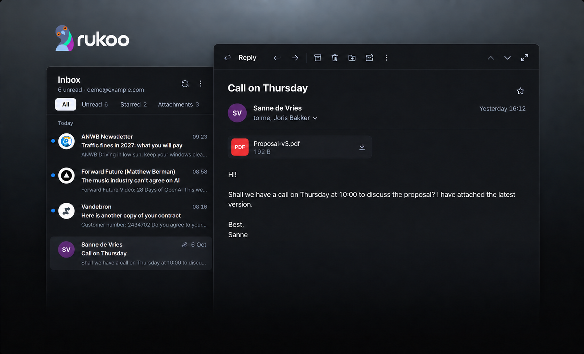

# Rukoo Mail

Rukoo Mail is an email client for Windows, built with Electron. It has three panes: folders on the left, a message list you can resize, and a reading pane where you also write. The interface uses Inter and supports English (the default) and Dutch. Choose a language during setup or in Settings → General → Language; the preference applies to every window and is saved.

A chat panel next to the email lets you hand it to an agent: a Hermes Agent such as Clark, Claude Code or Codex. The agent drafts the reply in the composer, plans follow-ups, looks things up in its own tools and asks you before it acts. See [Agents](docs/agents.md).

Translation labels have descriptive keys and screen context in the [English source catalog](src/i18n/en.js). See [the translation guide](docs/translations.md) for adding a language or finding a label.

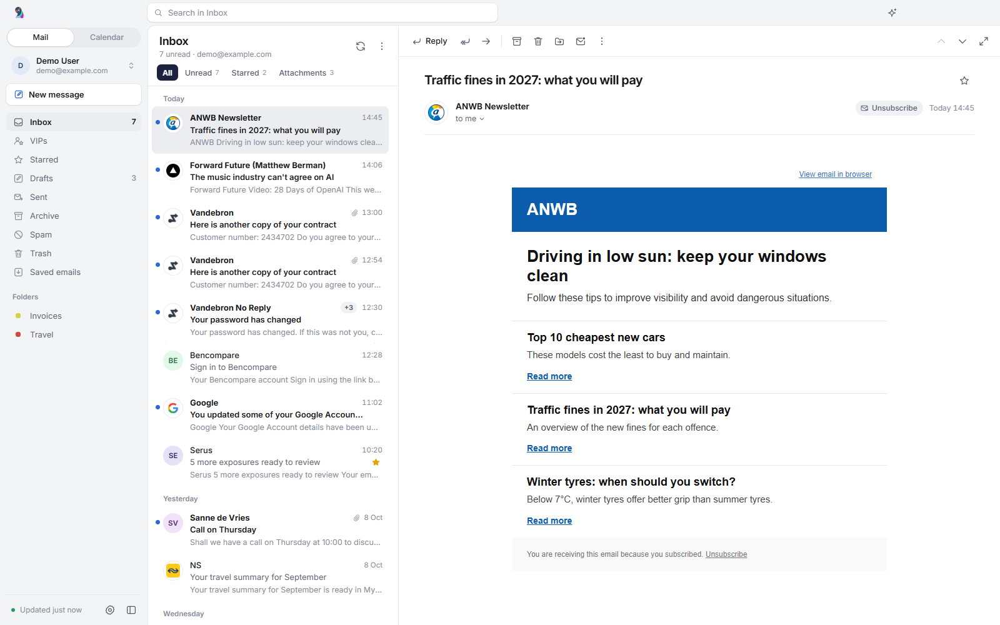

## What works

- "Sign in with Google" for Gmail and Google Workspace. You sign in in your browser (OAuth 2.0 with PKCE), after which IMAP and SMTP use XOAUTH2. No app password needed.
- IMAP accounts for Yahoo, Outlook, Exchange, Office365 and any other provider, with preset servers per provider and manual IMAP/SMTP settings.
- A demo account with English sample mail, so you can try the app without credentials.
- An account switcher at the top of the sidebar, with a unified inbox across accounts ("All accounts"). In the unified inbox each message carries a short account label.
- A sidebar with Inbox, VIPs, Starred, Drafts, Sent, Archive, Spam, Trash, Saved emails and your own folders. It collapses to an icon rail, and does so by itself in narrow windows.
- Search in the title bar, in the current folder, the current account or all accounts. Quick filters above the list: Unread, Starred and Attachments.
- The list shows sender logos for companies and initials for people, previews without "view in your browser" lines or greetings, and folds a run of three or more messages from one sender into a single row.
- The newest message opens when you start the app or switch folders; it stays unread until you open it yourself.
- Ctrl+click and Shift+click select several messages for one action. Right-click opens a menu with shortcuts, and you can drag messages onto a folder.
- Deleting, archiving and moving can be undone from the notice that follows, or with `Ctrl+Z`.
- The reading pane has its actions in a toolbar at the top; the subject moves into it when you scroll. The header reads "to me, Joris Bakker" and opens the full details on request. Newsletters get an "Unsubscribe" button that uses their List-Unsubscribe link, one-click where the sender supports it. Attachments show as compact cards with image thumbnails and "Save all". The mail keeps a readable width, and the grey canvas of newsletters is cleared.
- HTML mail renders in a sandboxed frame with scripts stripped. In dark mode HTML mail is recoloured; you can switch that off.
- New mail, replies and forwards open in the reading pane, with Send at the bottom right. A button moves the message into a window of its own, which remembers its size and position. Formatting appears above selected text, or as a row you switch on. Earlier mail in a reply waits behind a "···" pill and can be left out. There is recipient autocomplete, Cc and Bcc, attachments by picker or drag and drop, links and inline images.
- Drafts save to the server's Drafts folder automatically while you write. Opening another message keeps what you wrote as a draft; closing with unsaved changes asks whether to keep them.
- The app remembers the list width, the sidebar state and where the windows were. The list has a standard and a compact density.
- Swipe actions on touch screens: right marks read or unread, left deletes.
- Sorting, mark all as read, empty Trash, and new folders from the "+" next to Folders.
- A chat panel (`Ctrl+J`) for Hermes Agent, Claude Code and Codex. Quick actions draft a reply, brief you on the sender, plan follow-ups, tell the team, update other systems, unsubscribe and summarize. Agents read mail and write drafts through Rukoo's own MCP server and never send mail; anything other people will see waits for your approval. Works the same for every provider. See [Agents](docs/agents.md).
- Zoom from 80% to 200% with `Ctrl+Plus`, `Ctrl+Minus` or Ctrl and the mouse wheel. The main window and the compose windows share one level, and the app remembers it.
- Settings: language, theme, zoom, list density, swipe actions, fit content to the window, sender logos, notifications, taskbar badge, sync interval, signature (none by default), spam addresses, VIPs and folder visibility.
- Windows notifications for new mail and a count badge on the taskbar icon.

Keyboard in the main window: `Ctrl+N` new mail, `Ctrl+R` reply, `Ctrl+Shift+R` reply all, `Ctrl+F` forward, `Ctrl+E` or `/` search, `↑`/`↓` previous and next, `Shift+↑`/`Shift+↓` extend the selection, `Ctrl+A` select all, `Ctrl+Q` mark read, `Ctrl+U` mark unread, `Ctrl+Shift+V` move, `Delete` delete, `Ctrl+Z` undo, `Ctrl+P` print, `F5` sync, `Esc` clear the selection or search. While writing: `Ctrl+Enter` send, `Ctrl+S` save the draft, `Ctrl+K` insert a link, `Esc` close. In every window, also with the focus inside an email: `Ctrl+Plus` (or `Ctrl+=`) zoom in, `Ctrl+Minus` zoom out, `Ctrl+0` back to 100%. The numpad keys work too.

## Screenshots

These use the English interface and English demo emails. The same screens in dark mode are in [docs/screenshots/dark](docs/screenshots/dark). The inbox screenshot under the introduction shows the newest message opened by itself; "+3" marks three more messages from the same sender folded into one row. To take them again, run `npm run screenshots`. The capture script always uses English with a fresh demo profile.

Scrolled down, the subject moves into the toolbar.

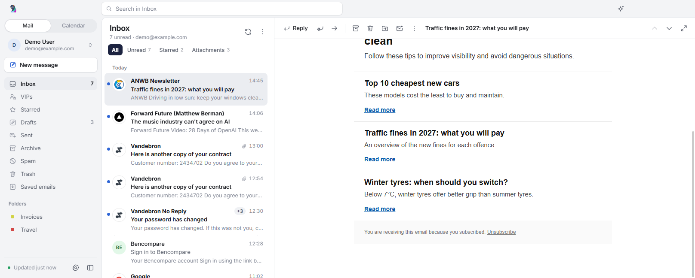

Personal mail reads "to me, Joris Bakker", with the attachment as a card.

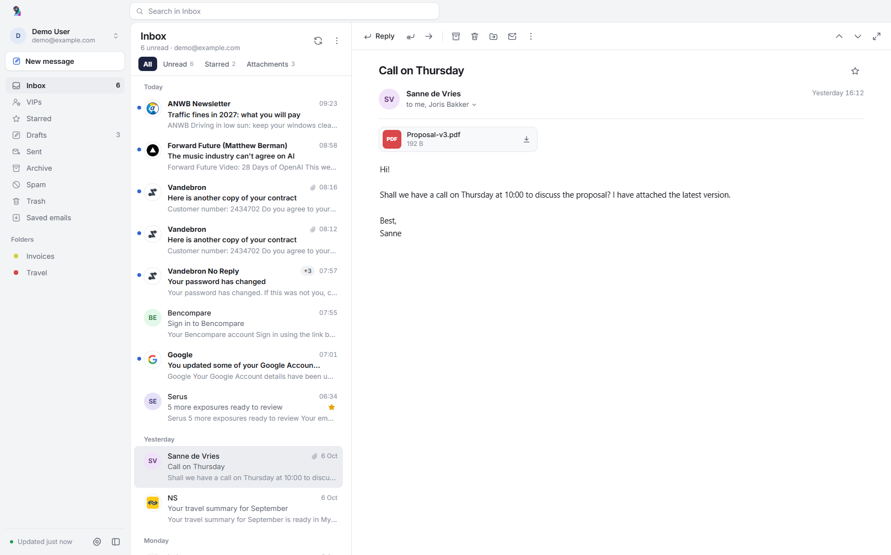

The full sender and recipient details, on request.

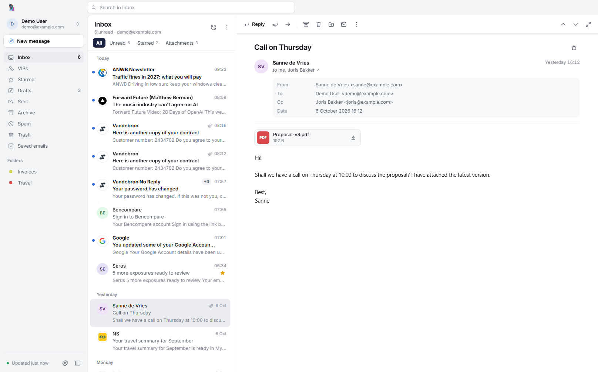

Four messages from Vandebron No Reply, unfolded from one row.

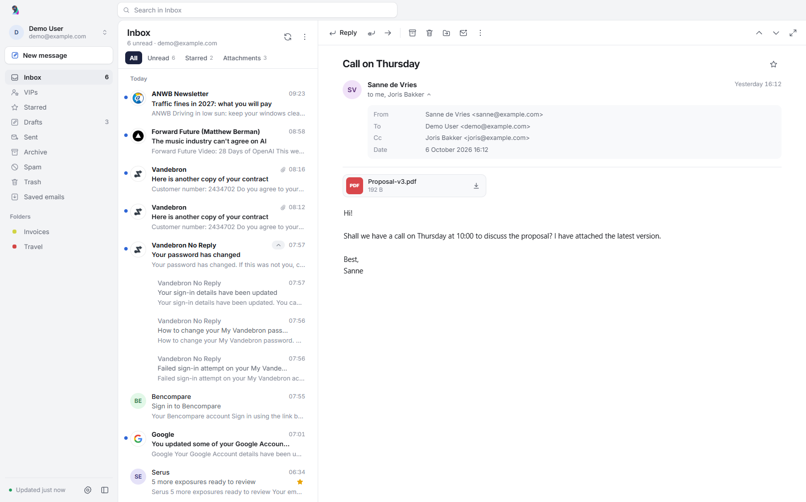

A reply in the reading pane, with the earlier mail behind "···".

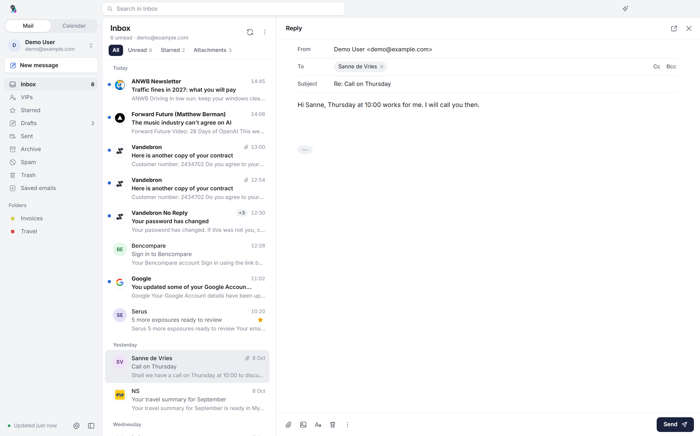

Formatting appears above selected text.

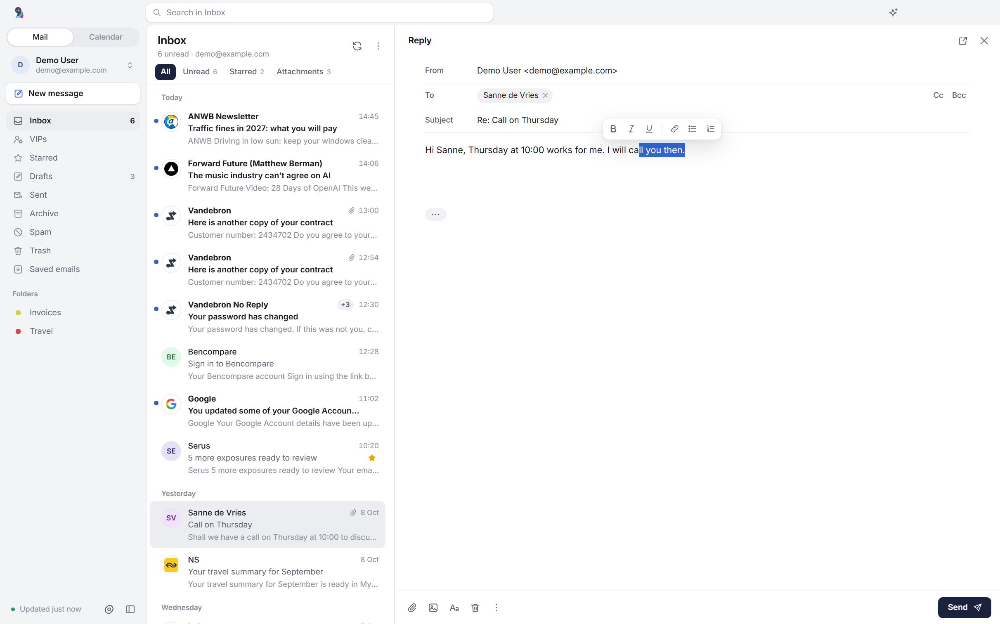

The earlier mail, with "Exclude from message" to leave it out.

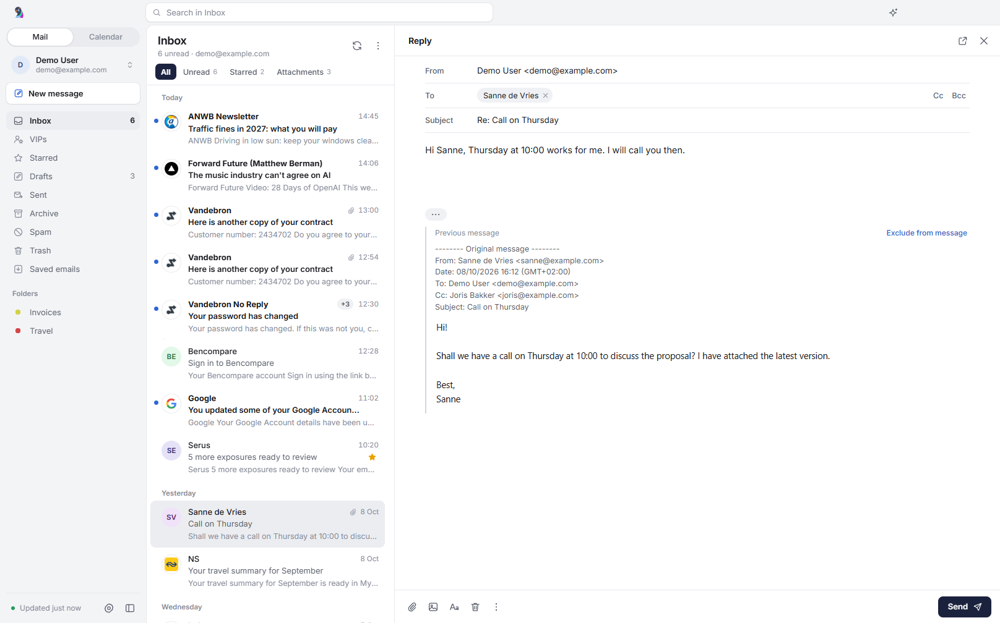

The first run.

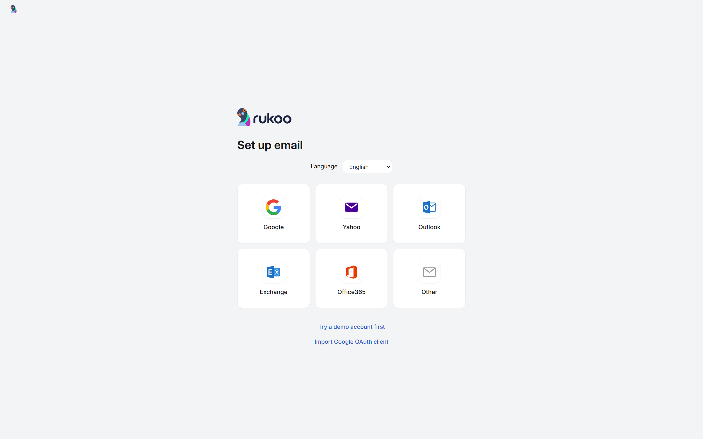

Settings.

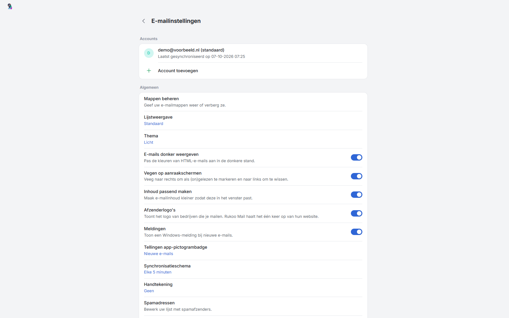

Clark drafted a reply to Sanne into the composer; the chat shows what it looked at.

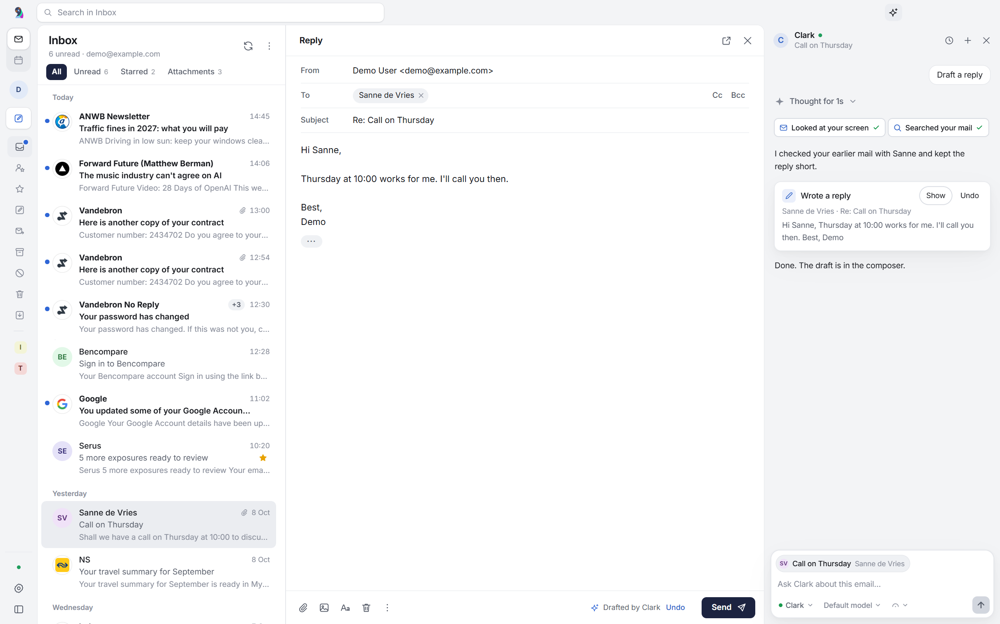

Planned follow-ups, and an approval card before anything goes to Todoist.

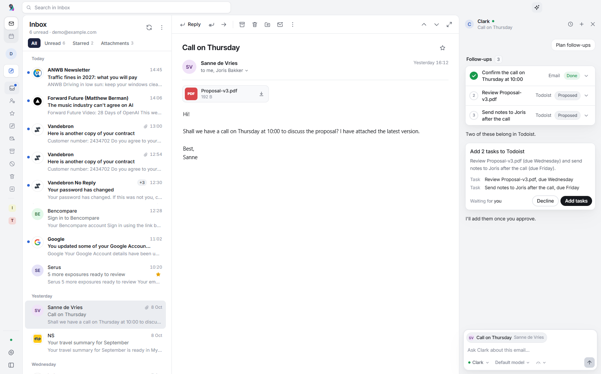
## Limits

Google sign-in needs an OAuth client of type "Desktop app" from Google Cloud. The client is not in this repository. The app looks for it in this order:

- the `SEM_GOOGLE_CLIENT_ID` and `SEM_GOOGLE_CLIENT_SECRET` environment variables;
- `%APPDATA%\Rukoo Mail\google-oauth.json`, as `{"client_id": ..., "client_secret": ...}` or Google's own download format, which "Import Google OAuth client" on the setup screen writes for you.

While the client's consent screen is unverified, Google shows a warning before you can continue. A Workspace admin may also have to trust the app for the `https://mail.google.com/` scope.

Other providers use IMAP and SMTP with a password; Yahoo requires an app password. Microsoft has switched off password sign-in for most Outlook.com and many Microsoft 365 mailboxes, and those need OAuth, which this app does not implement yet. Exchange works when the server offers IMAP and SMTP; Exchange ActiveSync is not supported.

Each folder keeps the newest 300 messages (inbox) or 100 (other folders) locally. Older mail stays on the server.

Sender logos are the icons companies publish on their own websites. The app fetches one per sender domain, caches it in `%APPDATA%\Rukoo Mail\logos` and tries a missing one again after a week. That request tells the company's web server that someone opened mail from it, much like loading images in the mail itself. Mail from free-mail providers such as Gmail or Ziggo never triggers a request. You can switch logos off in the settings.

Passwords and Google refresh tokens are encrypted with Windows DPAPI through Electron's `safeStorage`. Account data and the message cache live in `%APPDATA%\Rukoo Mail\data`. Earlier builds, named "E-mail", used `%APPDATA%\E-mail`; the app moves that folder on first launch.

## Run it

Requires Node.js 20 or newer.

```bash
npm install
npm start
```

`npm start` goes through `scripts/start.js`, which clears `ELECTRON_RUN_AS_NODE`. Terminals that run on Electron (VS Code, T3 Code) export that variable, and it makes `electron.exe` behave like plain Node.

Build a Windows installer and a portable exe in `dist/`:

```bash
npm run dist
```

## Tests

```bash
npm test          # unit tests for the engine and mail parsing, plus a live IMAP test
npm run test:e2e  # Playwright drives the real Electron app; chat tests use scripted agents (SEM_AGENT_FAKE=1)
```

The live IMAP tests create a throwaway mailbox on [Ethereal](https://ethereal.email) and skip themselves when it is unreachable.

## How it is built

| Path | Role |
| --- | --- |
| `src/main/engine.js` | Accounts, local cache, sync, flags, moves, sending, drafts, VIP's and spam |
| `src/main/google.js` | Google sign-in: loopback redirect, PKCE, token refresh |
| `src/main/imap.js` | IMAP via [imapflow](https://github.com/postalsys/imapflow), SMTP via nodemailer |
| `src/main/demo.js` | The demo account: same interface as `imap.js`, backed by a local JSON file |
| `src/main/main.js` | Main and compose windows, IPC table, notifications, taskbar badge, unsubscribe |
| `src/main/windowstate.js` | Remembers window size and position |
| `src/main/zoom.js` | Zoom steps and the zoom keys; `main.js` applies the level to every window |
| `src/main/logos.js` | Fetches and caches sender logos |
| `src/renderer/app.js` | The main window: sidebar, list, reading pane, selection, undo |
| `src/renderer/composer.js` | The editor, inline or in a window, with autosave |
| `src/renderer/compose.js` | The compose window around the editor |
| `src/main/agents/` | The chat panel's main side: conversations and approvals (`hub.js`), Rukoo's MCP server and tools (`mcp.js`, `tools.js`), and the Hermes, Claude Code and Codex adapters |
| `src/renderer/agent/` | The chat panel (`panel.js`), its quick actions, and the components ported from Beautiful UI (`bui.js`, `agent.css`) |
| `integrations/hermes/` | The stdio bridge that lets a Hermes agent on another machine reach Rukoo's tools over Tailscale |
| `src/renderer/` | Plain HTML, CSS and ES modules, no framework or bundler |

The renderer runs sandboxed with context isolation. It can only call the methods in the IPC table in `main.js`.

The interface font is [Inter](https://rsms.me/inter/) by Rasmus Andersson, under the SIL Open Font License (`src/renderer/assets/fonts/Inter-LICENSE.txt`).
