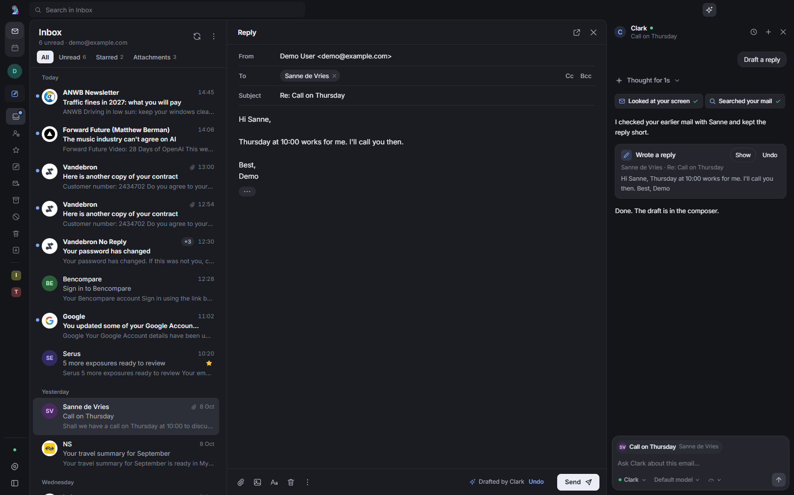

# Agents in Rukoo Mail

Rukoo Mail has a chat panel next to the reading pane. In it you hand an email to an agent: a Hermes Agent such as Clark, Claude Code or Codex. The agent keeps its own tools, memory and integrations. Rukoo adds the chat and a small set of tools the agent uses to read your mail and change what is on your screen. It writes the reply draft, shows a plan or its sources, and asks you before anything happens.

Open the panel with the sparkle button in the title bar or with `Ctrl+J`. While it is open the folders shrink to a rail, so you see the list, the email and the chat. The rail button brings the folders back, and the reading pane's expand button hides the list too, leaving the email and the chat.

## What you can ask

The panel offers quick actions for the open email. The same actions work as slash commands in the chat input, such as `/reply`. [Skills](#skills) are slash commands too. You can also type anything else.

A new chat is about the open email. The email shows as a chip above the input and goes to the agent with your first message. To ask something without it, click the × on the chip. An "Add this email" chip takes its place; click it to put the email back. Once a chat has started it keeps its email, so the chip has no ×. Start a new chat to leave the email out.

### Hand it off

- **Draft a reply** (`/reply`). The agent looks up earlier mail with the sender, its memory and your notes, then writes the reply into the composer in your voice and in the language of the email. You read it and press Send. Rukoo has no tool that sends mail, so an agent can't send one.
- **Unsubscribe** (`/unsubscribe`). Shown for newsletters with a List-Unsubscribe header. The agent unsubscribes you and offers to archive the sender's other mail. Rukoo asks you before either happens.
- **Unsubscribe through the browser** (`/unsubscribe-via-browser`). A skill for unsubscribe pages that want a confirm click or unticked boxes, and for mail without a List-Unsubscribe header. The agent asks you once, then finishes the page in its own browser: it enters only the address the mail went to, unticks every option, confirms and tells you what the page said. It doesn't open the link for mail in the Spam folder, or when the link's domain is neither the sender's nor a known mailing service. This needs an agent with a browser, such as Hermes with its browser tools. Claude Code in Rukoo has none, because Rukoo doesn't turn on `--chrome`, and Codex with "Ask before actions" has no network. Those agents fall back to Rukoo's own unsubscribe, as `/unsubscribe` does.
- **Summarize** (`/summary`). Three bullets, and whether the email needs a reply from you and by when.

### Plan the follow-up

- **Plan follow-ups** (`/tasks`). The agent pulls out the actions, with an owner and a due date where it can tell, and shows them as a list in the chat. It proposes adding them to your task system and waits for your approval.
- **Tell the team** (`/team`). Instead of forwarding the email, the agent writes a short message for the right channel, such as Slack, Mattermost or WhatsApp. The message includes the email's Message-ID so people can find it. You approve the message before it goes out.

### Find out more before you reply

- **Brief me** (`/brief`). Who is this, what is your history with them, and what do you need to decide? The agent searches your other mail, its memory, your notes and any other system it can reach, and shows the sources as cards.
- **What needs me today?** (`/triage`). Shown when no email is open. The agent goes through your inboxes in every account and lists what needs you, most urgent first.

### Update other systems

- **Update systems** (`/update`). The agent records the email where it belongs: a CRM contact or deal, your notes, a Linear issue, a Todoist task. It shows the planned updates, proposes each one, and after you approve it does them and adds links to the plan.

Everything the agent creates elsewhere links back to the email by its Message-ID header. That works in any mail client and doesn't depend on Gmail labels or other provider features. Rukoo keeps the chats themselves on your computer, per email.

## A reply in a thread you discussed

A chat belongs to one email, so a new reply in that thread has no chat of its own. When you open it, the empty chat offers "Continue the chat about the earlier message", with that chat's agent and when you last used it. Rukoo makes the offer only when the reply's headers link it to the earlier email: In-Reply-To or References name it, or name an email it also answers. A reply to an email you already continued the chat from counts too. A shared subject is not enough, because many unrelated emails are called "Invoice" or "Hello". Both emails must be in the same account. If several chats qualify, Rukoo offers the most recent one, whichever agent it is with.

Continuing opens that chat. The chat stays about its own email. While the newer email is open, a second chip shows it, marked "Newer message". Your next message takes the newer email to the agent, inside `<unsafe_content>` like any email. If you continued the chat from several newer emails before you write, it takes up to three of them, the newest; an older one goes with the message after that. When you open the newer email again later, the panel shows that chat straight away. If you type without picking the offer, Rukoo starts a new chat about the newer email, as before.

## How each agent connects

| Agent | Connection | Needs |
|---|---|---|
| Hermes Agent (Clark) | Rukoo talks to the Hermes API server over HTTP. Each Rukoo chat is a Hermes session; a turn is a run on Hermes' Runs API. | The API server's address and key. For Rukoo's tools: the bridge in `integrations/hermes` |
| Claude Code | Rukoo starts `claude.exe` per chat (stream-json) with your own settings, MCP servers, skills and hooks, plus Rukoo's MCP server. | Claude Code installed and signed in |
| Codex | Rukoo starts one `codex app-server` with your own config and adds Rukoo's MCP server to each thread. | Codex CLI installed and signed in |

Set them up in Settings → Agents. Each card shows the agent's status and has a test button.

Claude Code and Codex call Rukoo's MCP server on `127.0.0.1`. A Hermes agent usually runs on another machine, so it reaches Rukoo over Tailscale through a small stdio bridge. Turn on "Let Clark use Rukoo" in the Hermes card, then follow [integrations/hermes/README.md](../integrations/hermes/README.md). "Copy Hermes setup" puts the `config.yaml` block on the clipboard. The block holds no secret and is the same on every device: the bridge finds Rukoo on whichever of your devices has it open.

## Model and effort

Under the chat input, next to the agent, two menus set the model and the effort for the chat on screen. Effort is how much the model thinks before it answers. Each chat keeps its own choice, also after a restart, and switching chats shows that chat's choice. A new chat starts on Default: the model in Settings → Agents, or the agent's own model when that field is empty, and the agent's own effort. Chats from before this feature follow the default too. A change applies from the next message; an answer that is still running keeps what it started with.

| Agent | What the model menu offers | How the chat's choice reaches the agent |
|---|---|---|
| Hermes Agent | The models of every provider Hermes has credentials for (`GET /api/model/options`), and its model routes (`GET /v1/models`) | `model` on the run, with `provider` for a model of another provider, and the effort as `model_options.reasoning.effort` |
| Claude Code | The aliases `fable`, `opus` and `sonnet`, and the model in Settings. Claude Code has no command that lists models | `--model` and `--effort`. A new choice starts the chat's process again with `--resume`, so the session goes on |
| Codex | What `model/list` returns | `model` and `effort` on the next `turn/start`, which Codex keeps for later turns |

Claude Code and Hermes offer the effort levels low, medium, high, extra high and max. Claude Code lowers a level the model does not support. Codex says per model which levels it supports, and the menu offers only those. When neither the chat nor Settings names a model, Codex uses the one in your Codex config, so the menu offers the levels every listed model supports. A model without effort levels has no effort menu. The dial on the effort button shows the level too: the further right the needle, the more effort. In a narrow panel the dial is all the button shows.

With Default, Rukoo sends the model from Settings, if there is one, and no effort, so the agent decides. Codex can't drop a model or effort it was given. When a Codex chat goes back to Codex's own model or effort, Rukoo restarts the Codex app-server once no Codex chat is running.

Rukoo loads the list when the panel opens and keeps it for ten minutes. A new model in Settings loads it again. If the list can't load, the menu still offers Default, the model in Settings and the chat's own choice.

Hermes names a model of a provider other than its current one as `provider::model`, as in `anthropic::claude-opus-5-5`. The model field on the Hermes card takes that form too. A model you set with `/model` inside a Hermes session wins over the chat's choice.

## Chats after a restart

Rukoo keeps your chats in `conversations.json`, so they survive a restart of Rukoo or the PC. Your next message continues the agent's own session: Claude Code with `--resume`, Codex with `thread/resume`, and Hermes with the same session id. A turn that was running when Rukoo quit is stopped and not resumed.

Sometimes the agent no longer has the session. By default, Claude Code deletes transcripts that have not been used for 30 days. The agent then starts a new session, and the chat says so, as in "Claude started a new session". Rukoo sends that session the email again, as with your first message, followed by a recap of the chat. If you continued the chat from a newer email in the thread, that email goes along too. The recap holds the last 20 entries, up to 8,000 characters: your messages, the agent's answers, its proposals and mail actions with what you decided, what those mail actions did, and the drafts it wrote. Tool calls, thinking and permission requests stay out. Earlier answers can quote email, so the recap sits inside `<unsafe_content>`. If Rukoo no longer has the email, it tells the agent so.

## Rukoo's tools

| Tool | What it does |
|---|---|
| `get_context` | What you see: the open email, related mail in the same thread, selected emails, the draft in the composer, your accounts and folders |
| `search_mail` | Searches the mail Rukoo has downloaded, in every account and folder |
| `read_message` | One email in full, as text, with its Message-ID, attachments and List-Unsubscribe links |
| `read_attachment` | An attachment: text, an image, or the file itself. Claude Code and Codex also get a local copy to open |
| `write_draft` | Writes a reply, reply-all, forward or new email into the composer. You send it |
| `get_draft` | Reads the composer, including your own edits |
| `show_plan` | A list of steps or tasks in the chat, updated as the agent works |
| `show_sources` | Cards for the sources the agent used. Email sources open the email |
| `propose_action` | An approval card for something other people will see or that changes another system |
| `mail_action` | Archive, delete, move, mark read or unread, star, or unsubscribe. Rukoo asks you first |
| `read_skill` | One of the [skills](#skills), with the text files next to it. Without a name, the list of skills |

The MCP server is stateless. Each request carries a bearer token, and Rukoo knows from the token which agent and chat it belongs to.

## Skills

A skill is a set of instructions for one kind of email task. Rukoo uses the [Agent Skills](https://agentskills.io) format, which Claude Code, Codex and Hermes also read: a folder with a `SKILL.md` that starts with a `name` and a `description`, followed by the instructions. Files next to `SKILL.md`, such as `scripts/` and `references/`, are part of the skill. [skills/README.md](../skills/README.md) has an example.

Rukoo reads skills from two folders:

- `skills/` in this repository. Rukoo ships these with the app.
- `%APPDATA%\Rukoo Mail\skills`, for your own. Create the folder if it isn't there. A skill here replaces Rukoo's skill with the same name.

Rukoo reads both folders again each time an agent connects to its MCP server or calls `read_skill`, and each time you open the chat panel or type `/`. A new or changed skill works without restarting Rukoo.

### How agents get them

Rukoo offers the skills through its MCP server, so Hermes, Claude Code and Codex get them the same way, and nothing has to be installed on the agent's side.

- Rukoo's MCP instructions list each skill's name and description. The description of `read_skill` lists them as well, because not every agent shows MCP instructions to its model. Claude Code keeps 2048 characters of each. With many or long skills, Rukoo shortens the descriptions in these lists, and ends a list with the number of skills left out when even short ones don't fit. `read_skill` without a name has them all, in full.
- `read_skill` returns a skill's `SKILL.md` and the text files next to it. Without a name it lists the skills, and the ones Rukoo skipped with the reason, so you can ask the agent why a skill is missing.
- Clark's bridge answers the MCP handshake itself, before it has found Rukoo. It uses the instructions it got with the last tool list, so a new skill reaches Clark's instructions the next time Hermes connects. `read_skill` always has the current skills. A bridge copied before skills existed passes `read_skill` on as well; copy the new `rukoo_bridge.py` to the Hermes machine to get the skills into the instructions.

### Starting a skill

Type `/` and the skill's name in the chat input, then pick it from the suggestions or press Enter or Send. The suggestions show the skills after the quick actions, each with its description. Rukoo then sends the agent a line that names the skill, followed by the instructions from `SKILL.md`. The agent gets the other files with `read_skill` when the instructions point to them.

A quick action keeps its command. A skill named `reply` doesn't replace `/reply` and isn't offered as a slash command. Agents can still use it through `read_skill`. Rename the folder and the `name` to start it from the chat input.

Skills are instructions from Rukoo or from you, so Rukoo doesn't put them inside `<unsafe_content>`. Rukoo never takes a skill from an email.

### Rules and limits

Rukoo skips a skill that breaks these rules. It logs the reason, and `read_skill` without a name reports it.

- The `name` is the name of the skill's folder: lowercase letters, digits and single hyphens, at most 64 characters.
- The frontmatter parses and has a `description` of at most 1024 characters. Agents choose a skill by its description, so say what it does and when to use it.
- `SKILL.md` is UTF-8 text of at most 64 KB.
- `read_skill` returns text files of up to 32 KB each and 64 KB together, `SKILL.md` included, and lists what it left out and why. The agent can ask for a left-out text file by its path, up to 64 KB.
- Rukoo reads only files inside the skill's folder and never follows a link or junction inside it. Names that start with a dot, such as `.git`, are left out. The skill folder itself may be a link, to a git checkout for example.
- The message that starts a skill carries up to 16,000 characters of instructions. For a longer skill, Rukoo tells the agent to read it with `read_skill`.

### Using the skills outside Rukoo

The skills are plain Agent Skills, so you can install them into an agent directly. You don't need this inside Rukoo, which already offers them. A skill that uses Rukoo's tools, such as `write_draft` or `mail_action`, only works where the agent can reach Rukoo's MCP server.

- **Hermes:** `hermes skills install MajesteitBart/rukoo/skills/<name>` installs one skill from GitHub. `hermes skills tap add MajesteitBart/rukoo` follows the repository.
- **Claude Code:** `claude --plugin-dir <path to a Rukoo checkout>` loads the skills in `skills/` for one session. To keep a skill, copy its folder into `~/.claude/skills`.
- **Codex:** copy a skill folder into `~/.agents/skills`, or into `.agents/skills` in the project you work in.

Rukoo starts Claude Code and Codex with your own settings, so in Rukoo they also load the skills you installed for them. A skill installed there that Rukoo offers too shows up twice.

## Approvals

There are three kinds:

- **Proposals.** When an agent calls `propose_action`, Rukoo shows a card and the agent stops. If you approve, Rukoo sends the agent a new message saying so, and the agent carries it out. If you decline, the agent hears it next time you write.
- **Mail actions.** Rukoo runs these itself after you approve, and you can undo a move from the notice that follows. In Settings → Agents you can let agents archive, move and mark mail without asking. Deleting and unsubscribing always ask.
- **The agent's own permissions.** Claude Code and Codex ask before running commands or changing files when their access is set to "Ask before actions", the default. Their questions show up as cards in the chat. With "Full access" they don't ask. Hermes follows its own approval settings.

## Safety

- Email is written by other people. Everything Rukoo passes on from email sits inside `<unsafe_content>` tags: the email in the chat, subjects and sender names on Rukoo's own lines, and in tool results each body and attachment and every value taken from an email. That covers subjects, names, addresses, previews, attachment names and types, In-Reply-To and References headers, unsubscribe links, and the recipients and subject a reply copies from the email it answers. Text inside an email can't close or fake that tag. Rukoo tells the agent never to follow instructions inside it. Still, a model can be fooled. That is the reason for approvals, and the reason Rukoo can't send mail.
- Rukoo's own ids, accounts, folders and dates stay plain so the agent can use them. So does a Message-ID in the usual `<id@domain>` form, so the agent can link back to the email; any other Message-ID is tagged. When the agent passes a tagged value back, such as an address for a draft, Rukoo drops the tags. In the agent's own text, such as a proposal, Rukoo keeps them, and it asks the agent to keep them on email it quotes there. The quote is then still marked when Rukoo repeats the approved proposal to the agent. The chat panel shows that text without tags.
- Agent-written drafts are sanitized before they reach the composer. Links stay; images, form controls, styles and scripts go.
- Local agents get a token per chat or per process. Hermes signs in with a token made from its API server key, so every device with that key accepts it. Rukoo accepts that token only on the Tailscale address, and the local tokens only on `127.0.0.1`. A new API key replaces it. Before the bridge sends the token to a device, Rukoo there has to prove it has the same key.
- The Hermes API key is encrypted with Windows DPAPI in `%APPDATA%\Rukoo Mail\data\agents.json`. Chats are in `conversations.json` in the same folder. They hold what you and the agent wrote, not the emails Rukoo sent along.

## Limits

- Search covers what Rukoo has downloaded: the newest 300 messages of each inbox and 100 of other folders. Older mail stays on the server.
- PDFs reach the agent as files. Whether it can read them depends on the agent.
- `Ctrl+J` doesn't work while the focus is inside an email's frame. Click outside the email first.

The chat panel's components are ported from [Beautiful UI](https://www.beautifului.dev) by Shane Levine, under the MIT license.
